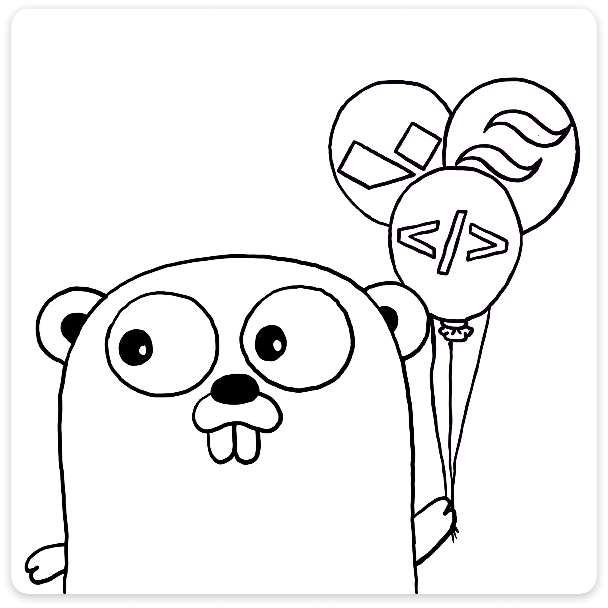

# GHAT(D)

<div align="center" style="padding-bottom: 8px;">
  
</div>

GHAT(D) is an open-source, opinionated, free, full-stack web application framework based on the Go programming language. Its name is an acronym that stands for Go, HTMX, Alpine.js, Tailwind, and DaisyUI. The aim is to make GHAT(D) a good foundation for creating highly portable, scalable, and performant full-stack projects. Only need a backend? landing page? (or blog (coming soon))? Don't worry, you can use still use GHAT(D).

See below for more information on the core components used for this stack.

- **go:** [v1.22.x](https://go.dev/doc/install)
- **htmx:** [v1.9.10](https://htmx.org/)
- **alpine.js:** [v3.x](https://alpinejs.dev/essentials/installation#from-a-script-tag)
- **tailwindcss:** [v3.x](https://github.com/asdf-community/asdf-golang)
- **daisy ui:** [v3.x](https://daisyui.com/docs/install/)
  - Notable alternatives include:
    - **flowbite:** [v2.3.x](https://flowbite.com/docs/getting-started/introduction/#include-via-cdn)
    - **wind-ui:** [v.3.4.x](https://wind-ui.com/)
- **version manager:** [asdf](https://github.com/asdf-vm/asdf)

> The dashboard's base template was taken from the `TailAdmin team`. Please support them by [**purchasing their templates**](https://tailwindadmin.netlify.app/) or giving their [**GitHub repository**](https://github.com/TailAdmin/tailadmin-free-tailwind-dashboard-template) a star.


## Motivation

GHAT(D) is a hobby project I work on in my spare time. This project is designed to provide a good "getting started" framework for people like me who are interested in Go, APIs, and Web Applications and want a consistent base & standards on which to build projects. I hope that this framework can be used as a foundation for building out many awesome projects and initiatives.

I also aim to use this project as a learning opportunity, to improve my understanding of and share my knowledge of lightweight frontend libraries, highly portable full-stack alternatives, and cost-effective infrastructure solutions for full-scale products. 

As I develop this project, I will create tutorials/guides for those who want to integrate it with other technologies, such as `rpc`,  `graphql`,  `websocket`, and others.

I am a platform engineer by trade, so I do not promise perfect code by any stretch of the imagination (especially with the front end - so please support and contribute). Instead, I am aspiring to create a standardised framework that helps those curious (about Go, APIs, hubby projects, and web app development) to turn their ideas/ hobbies into tangible product(s) that they can demo and even ship.

This will be an exciting experience, and I look forward to building out this project with you all and sharing my progress and knowledge as it matures.

## Starting the server

Before getting started please mak sure you have the correct version of [Go installed](https://go.dev/doc/install) or you can use [ASDF](https://github.com/asdf-vm/asdf) to install it with the following command

```sh
# Add the plugin for Go
asdf plugin-add golang

# Install required version
asdf install
```

To start the server you can use the code:

```sh
go run main.go start-server
```

However, for a better development expierence, please install the package [`reflex`](https://github.com/cespare/reflex) which will enable you to hot-reload by rerun a specified command on file change, and running the command:

```sh
reflex -r '\.(html|go|css|png|svg|ico|js|woff2|woff|ttf|eot)$' -s -- go run main.go start-server
```

> More [information on hot-reloading can be found below](#hot-reloading)


## Good to know

### Remember to replcae

After you have cloned this repository, please make sure to replace or update the following:

- `github.com/ooaklee/ghatd`
- `tbc`

### ASCI Art

All ASCI related code in this template was created using [PatorJK](https://patorjk.com/software/taag/#p=display&h=2&f=Isometric3)

### Core internal packages

Some core internal packages are used across the codebase without injection; they include:

- `internal/response`
- `internal/router`
- `internal/toolbox`
- `internal/common`

### Curl Examples

- Making `GET` resquest: `curl -i -X GET "http://localhost:4000/api/v1/rememberer/words"`

### How to stop file server showing directory listing?

Add a blank index.html file to the specific directory that you want to disable listings for. For example, the
code below will create an index file which will stop [the webapp](http://localhost:4000/static/) from showing 
and listing page.

```sh
touch internal/webapp/ui/static/index.html
```

### Hot reloading

Install reflex

`go install github.com/cespare/reflex@latest`

> You can find more information in the repo https://github.com/cespare/reflex

Once installed, run the server

```
reflex -r '\.(html|go|css|png|svg|ico|js|woff2|woff|ttf|eot)$' -s -- go run main.go start-server
```

### How to build binaries

One of the benefits of using the GHATD stack is that it compiles everything into a single binary. This makes it highly portable and provides numerous deployment options. To build a binary for your specific system, please follow the instructions below:

> All commands should be executed from the root directory.

#### Mac OS (ARM64)

```sh
export BINARY_NAME=ghatd
CGO_ENABLED=0 GOOS=darwin GOARCH=arm64 go build -a -installsuffix cgo -ldflags="-w -s" -o ./$BINARY_NAME main.go
```

#### Mac OS (AMD64)

```sh
export BINARY_NAME=ghatd
CGO_ENABLED=0 GOOS=darwin GOARCH=amd64 go build -a -installsuffix cgo -ldflags="-w -s" -o ./$BINARY_NAME main.go
```

#### Linux (ARM64)

```sh
export BINARY_NAME=ghatd
CGO_ENABLED=0 GOOS=linux GOARCH=arm64 go build -a -installsuffix cgo -ldflags="-w -s" -o ./$BINARY_NAME main.go
```

#### Linux (AMD64)

```sh
export BINARY_NAME=ghatd
CGO_ENABLED=0 GOOS=linux GOARCH=amd64 go build -a -installsuffix cgo -ldflags="-w -s" -o ./$BINARY_NAME main.go
```

## License
This project is licensed under the [MIT License](./LICENSE).
