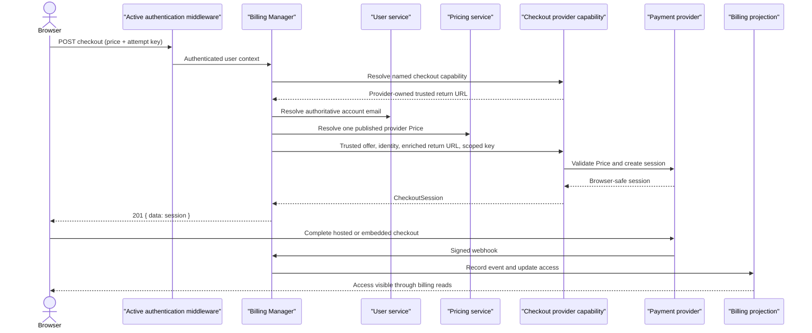

## Status

Accepted.

## Context

Payment providers need provider-specific code to create hosted or embedded
checkout sessions. Host applications also need authentication, pricing
catalogue validation, user resolution, idempotency, return-destination policy,
and consistent HTTP errors before a provider API is called.

Implementing those checks in every host duplicates security-sensitive code and
allows catalogue and provider behaviour to drift. Moving all behaviour into a
provider adapter would create a different problem: adapters would need to know
about application users, published plans, and HTTP policy that do not belong to
the provider API.

The existing payment-provider registry already owns the name-to-provider
relationship used for webhooks. Checkout is an optional provider capability,
and not every webhook provider can create a browser session.

## Decision

Billing Manager will expose the authenticated route:

```text
POST /api/v1/bms/billings/{providerName}/checkout?price={providerPriceID}
```

Billing Manager will own:

- authenticated user identification and authoritative email lookup;
- provider capability discovery through the existing provider registry;
- published, effective, non-deleted catalogue selection;
- exact cost-level provider Price matching and duplicate detection;
- rejection of catalogue terms that the common checkout contract cannot
  represent;
- mapping one-time and recurring cadences to the provider-neutral checkout
  modes;
- scoping untrusted idempotency keys to the user, provider, and selected price;
- trusted return-destination enrichment and request-origin policy;
- the standard HTTP response envelope and stable error mapping; and
- passing trusted plan, cost, amount, currency, cadence, and trial data to the
  selected provider.

The payment provider will own:

- provider API authentication and versioning;
- exposure of its configured trusted return destination through an additive
  checkout-configuration capability;
- validation of provider-specific constraints;
- live validation that the provider Price still matches the trusted catalogue
  amount, currency, and cadence;
- creation and validation of the browser-safe checkout session; and
- provider webhook verification and payload normalisation.

The host application will own:

- provider credentials and endpoint configuration;
- the trusted checkout return destination configured on the registered
  provider instance;
- provider catalogue records and migrations;
- CORS, cookies, and outer router middleware; and
- frontend rendering of a provider's browser checkout component.

The concrete payment-provider registry will expose checkout through an
additive optional capability. Billing Manager will detect that capability
without widening its existing webhook-registry interface, preserving custom
webhook-only registries. A separately supplied checkout-capability registry
remains an escape hatch for custom composition. Checkout providers may expose
their trusted base return destination through the separate optional
`paymentprovider.CheckoutReturnURLProvider` capability. This keeps the
registry-selected provider as the single source of both checkout behaviour and
checkout configuration without widening either the base provider or checkout
interfaces.

The request mapper will derive the user ID from authenticated request context
and the provider name from the route. It will accept only the provider Price ID
from the query and an optional attempt key from the `Idempotency-Key` header.
Customer identity, amount, currency, cadence, mode, metadata, and return URL
will never be accepted from browser input.

Checkout creation returns `201 Created`, `Cache-Control: no-store`, and the
normal GHATD data envelope containing a `paymentprovider.CheckoutSession`.
Creating a session does not grant access. Signed provider webhooks remain the
authority that creates billing events and changes the billing access
projection.



## Alternatives Considered

We considered keeping a checkout handler in every host application. That keeps
return routing nearby but duplicates catalogue, identity, idempotency, and
error policy in every application.

We considered registering a second slice of checkout providers. That would
duplicate the name-to-provider relationship already held by the provider
registry and could allow webhook and checkout registrations to diverge.

We considered keeping a separate Billing Manager map for trusted return URLs.
That would make provider selection and provider checkout configuration two
independently maintained sources keyed by the same name. Provider-owned
configuration avoids that drift. The former configuration method remains only
as a deprecated compatibility fallback for custom providers during migration;
a non-empty provider-owned value takes precedence.

We considered adding checkout methods to the base payment-provider interface.
That would force webhook-only providers and existing test doubles to implement
an unsupported capability.

We considered allowing the browser to send plan metadata or a return URL. That
would let an untrusted request influence the charged offer, user association,
or navigation destination and was rejected.

We considered treating the browser return as proof of payment. Redirects and
embedded completion callbacks are not signed fulfilment signals, so access
continues to depend on verified webhooks.

## Consequences

Host applications no longer need a provider-specific backend checkout handler.
They still configure provider credentials, the return destination, catalogue
records, and provider-specific frontend components. The return destination is
set once when constructing the provider that is registered for both webhooks
and checkout; standard Starter composition requires no checkout-specific
post-construction registration.

Checkout-capable providers become reusable across hosts, and catalogue policy
has one testable implementation. Adding a provider still requires a supported
pricing provider key and an adapter that implements the optional checkout
capability.

`paymentprovider.Config` is an exported alpha API. Adding `ReturnURL` changes
the positional shape of that struct, so integrations using unkeyed composite
literals must migrate. Host applications should use keyed configuration
literals; doing so also isolates them from future additive configuration
fields.

A non-empty provider-owned `ReturnURL` is the implicit checkout opt-in. Starter
validates complete checkout credentials and an absolute HTTP(S) return URL for
providers that expose the optional validation capability. An empty return URL
remains valid for webhook-only and provider API-sync deployments. Manual
composition must perform the same validation at startup; Billing Manager and
the provider registry also fail closed if opted-in configuration is invalid.

The standard response envelope differs from historical raw session responses.
Frontends should temporarily accept both shapes during coordinated rollout,
then use the standard envelope as the canonical contract.

Provider idempotency prevents duplicate provider sessions for a repeated
attempt key, but it is not a durable application-level replay store. A future
workflow that guarantees replay of a prior response after ambiguous network
failure will require persisted checkout-attempt state.

Catalogue discounts, setup fees, and custom payment terms fail closed until
the common checkout contract can represent and verify them. A plan can remain
visible while its unsupported cost is unavailable for checkout.

## Regression and Rollout Invariants

Future changes must preserve these boundaries unless a superseding ADR says
otherwise:

- only an authenticated context supplies the checkout user ID;
- the customer email is resolved from server-owned user state;
- provider selection uses a registered optional checkout capability;
- catalogue selection scans all bounded result pages and rejects ambiguity;
- provider Price ID, amount, currency, cadence, and plan metadata are derived
  from one trusted cost;
- return destinations are configured by the host on the registered provider,
  exposed through an optional provider capability, and never supplied by the
  browser;
- raw client idempotency keys are never forwarded to a provider;
- provider errors and secrets are not exposed in HTTP responses;
- checkout responses are non-cacheable; and
- browser completion never grants access without a verified billing event.

Service, fender, handler, route, registry, provider-adapter, and starter tests
must cover these invariants whenever checkout orchestration changes.
