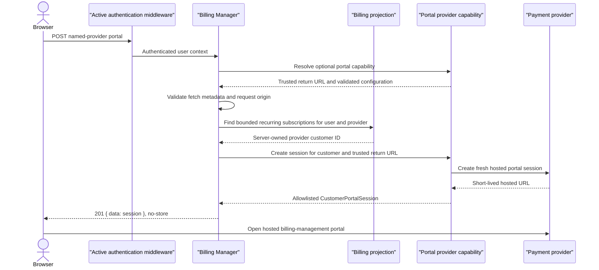

## Status

Accepted.

## Context

Some payment providers expose hosted billing-management portals for invoices,
payment methods, subscription changes, and cancellation. Access to those
portals commonly starts by creating a short-lived session for one provider
customer. Repeating that orchestration in every host application duplicates
authentication, customer ownership, origin checks, and error handling.

Billing subscriptions can also contain provider-supplied `UpdateURL` and
`CancelURL` values. Those stored projection fields are provider-dependent
action links. They are not proof that a fresh, authenticated hosted-portal
session exists, and they can become stale as subscription state changes.

The base payment-provider contract is already implemented by webhook-only and
custom providers. Portal support therefore cannot become a required method on
that interface without breaking existing implementations.

## Decision

Billing Manager will expose the authenticated route:

```text
POST /api/v1/bms/billings/{providerName}/portal
```

The route will create a fresh hosted session on demand. It will not redirect
to, or treat as equivalent, a stored subscription `UpdateURL` or `CancelURL`.
Those fields remain available to billing read models for providers whose
action-link lifecycle is independently understood by the host.

Portal support will use additive capabilities:

- `paymentprovider.CustomerPortalProvider` creates a hosted session;
- `paymentprovider.CustomerPortalReturnURLProvider` exposes the trusted return
  destination from the selected provider instance;
- `paymentprovider.CustomerPortalConfigValidator` validates provider-specific
  opt-in settings;
- `paymentprovider.CustomerPortalSessionURLValidator` verifies the provider's
  hosted-session origin before Billing Manager returns a URL to a browser.

The concrete provider registry will discover these capabilities by provider
name. Billing Manager will detect a compatible registry without widening the
existing webhook-registry interface. A separately supplied portal registry
will remain an escape hatch for custom composition. Existing providers, test
doubles, handlers, and registries therefore remain source compatible.

A non-empty provider-owned portal return URL opts a provider into the route.
Providers that support a named hosted-portal configuration may additionally
store its identifier in provider configuration. The return URL and
configuration identifier are server-owned values and are never accepted from
the browser. Checkout and portal return URLs remain separate because they have
different navigation and provider-configuration lifecycles.

Billing Manager will derive the user from authenticated request context and
the provider from the route. It will resolve the provider customer from
server-owned recurring subscription records filtered to that user and
provider. Active or trialing records are preferred; another recurring
lifecycle record can remain eligible for recovery, invoices, or cancellation.
One-time purchases are not eligible. Pagination is bounded and inconsistent
metadata fails closed. If the selected lifecycle tier contains more than one
distinct provider customer, the request also fails closed rather than opening
an arbitrary billing account.

Browser-origin policy is derived from the configured portal return URL.
Explicit cross-site fetches are rejected, and a supplied `Origin` must match
the canonical configured origin exactly. Billing Manager requires an absolute
HTTPS session URL; each provider adapter must also enforce its own hosted URL
allowlist before returning a session. Responses use `201 Created`,
`Cache-Control: no-store`, and the normal GHATD data envelope.



## Alternatives Considered

We considered keeping a provider-specific portal handler in each host. That
keeps application routing nearby but repeats security-sensitive customer
resolution and origin policy in every integration.

We considered redirecting to stored `UpdateURL` or `CancelURL` values. Those
links describe provider-specific subscription actions and do not provide the
same freshness, scope, or session contract as on-demand portal creation.

We considered accepting a provider customer ID or return URL from the client.
That would let untrusted input influence account ownership or navigation and
was rejected.

We considered adding portal methods to the base provider and Billing Manager
handler interfaces. Additive capability detection provides the route without
forcing unrelated implementations to change.

## Consequences

Host applications no longer need provider-specific backend logic to create
hosted portal sessions. They still own provider credentials, the portal return
destination, optional provider portal configuration, outer middleware, and
the frontend action that opens the returned URL.

Providers can support webhooks or checkout without supporting a customer
portal. An empty portal return URL remains valid for those deployments. When a
non-empty value opts a provider in, Starter validates any provider-specific
portal configuration during construction so invalid settings fail before
routes serve traffic.

The provider registry, the Billing Manager service, and the route all gain
optional capabilities rather than wider required interfaces. This reduces
migration work and keeps custom composition possible, but capability and
configuration failures must remain explicitly tested.

The shared `paymentprovider.Config` and `billingmanager.Service` structs gain
exported fields. Existing provider and handler interface implementations remain
source compatible, but Go callers that use positional, unkeyed literals for
either struct must migrate those literals to keyed fields when adopting this
release. Constructor-based composition is unaffected.

Subscription lookup adds bounded read work when a portal session is created.
Hosts must retain provider customer IDs on recurring billing projections and
must keep pagination metadata consistent. The configured return origin and
provider-hosted URL allowlist become operational configuration that must be
updated deliberately when navigation or provider domains change.

Stored update and cancel links are not removed by this decision. Hosts that
render them remain responsible for their provider-specific validity and user
experience; the generic portal route always creates a new session instead.

## References

- [Stripe Customer Portal Session](https://docs.stripe.com/api/customer_portal/sessions)
- [Stripe Create a Portal Session](https://docs.stripe.com/api/customer_portal/sessions/create)
- [Stripe Update a Subscription](https://docs.stripe.com/api/subscriptions/update)

## Regression and Rollout Invariants

Future changes must preserve these boundaries unless a superseding ADR says
otherwise:

- only authenticated request context supplies the user ID;
- browser input cannot supply a customer ID, return URL, or portal
  configuration identifier;
- provider selection uses a registered optional portal capability;
- only server-owned recurring subscription records establish customer
  ownership;
- ambiguous provider-customer ownership fails closed;
- subscription scanning is bounded and malformed pagination fails closed;
- explicit cross-site requests and mismatched origins are rejected;
- Billing Manager enforces an HTTPS session URL and providers enforce their
  hosted URL allowlists;
- portal responses are non-cacheable; and
- stored subscription action links never substitute for fresh session
  creation.
