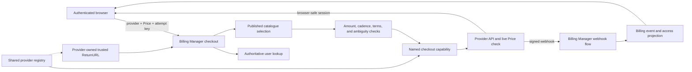

# Billing Manager

The recommended billing functionality comes in three independent, composable packages: `paymentprovider`, `billing`, and `billingmanager`. For most application features, use the high-level `billingmanager` package. It handles authenticated checkout and hosted customer-portal orchestration, webhook processing, access management, billing event tracking, and read-only pricing catalogue endpoints with integrated audit logging.

The billing manager can also expose the pricer package's read-only pricing endpoints through `WithPricerService()`, making plans and features available to frontend and client applications at `/api/v1/bms/pricing/plans`, `/api/v1/bms/pricing/plans/{slug}`, and `/api/v1/bms/pricing/features`.

## Core Packages Overview

Here's an overview of the core packages:

| Package | Purpose | Recommended Use Case | Examples |
|---|---|---|---|
| `paymentprovider` | Abstracts provider API capabilities, webhook verification, and payload normalisation (for example, Stripe and Lemon Squeezy). | Implementing or testing provider adapters. | [`paymentprovider/examples`](../paymentprovider/examples/examples.go) |
| `billing` | Manages subscription and billing event data persistence with a repository pattern. | Direct database operations or building custom billing workflows. | [`billing/examples`](../billing/examples/examples.go) |
| `billingmanager` | Orchestrates `paymentprovider`, `pricer`, users, and `billing` for checkout, webhooks, and billing reads. | Building application billing features with one trusted workflow. | [`billingmanager/examples`](examples/examples.go) |

### Usage Overview

For a high-level overview of how this might fit into your project, please [**visit this section**](#high-level-overview).

## Quick Start: Setup and Processing Webhooks

This section shows how to set up the `billingmanager` and process payment provider webhooks. This is the recommended way to use the system for standard operations. For more examples, [check out the reference examples above](#core-packages-overview).

### 1. Import Packages and Configure

You'll need configuration for `paymentprovider` and a `billing` service
instance. Shared checkout additionally requires user and pricing services;
audit logging remains optional.

```go
import (
    "context"
    "fmt"
    "net/http"

    "github.com/ooaklee/ghatd/external/billing"
    "github.com/ooaklee/ghatd/external/billingmanager"
    "github.com/ooaklee/ghatd/external/paymentprovider"
)

// Assume auditService, userService, and pricerService are initialised dependencies.

// 1. Configure payment providers
stripeConfig := &paymentprovider.Config{
    ProviderName:                  "stripe",
    WebhookSecret:                 "whsec_your_stripe_webhook_secret",
    APIKey:                        "sk_test_your_stripe_api_key",
    PublishableKey:                "pk_test_your_stripe_publishable_key",
    ReturnURL:                     "https://app.example.test/app/plan?checkout=pending&session_id={CHECKOUT_SESSION_ID}",
    CustomerPortalReturnURL:       "https://app.example.test/settings/billing",
    CustomerPortalConfigurationID: "bpc_example", // Optional provider configuration.
}

lemonSqueezyConfig := &paymentprovider.Config{
    ProviderName:  "lemonsqueezy",
    WebhookSecret: "your_lemonsqueezy_webhook_secret",
    APIKey:        "your_lemonsqueezy_api_key",
}

kofiConfig := &paymentprovider.Config{
    ProviderName:  "kofi",
    WebhookSecret: "your_kofi_verification_token",
}

// 2. Create payment providers
stripeProvider, err := paymentprovider.NewStripeProvider(stripeConfig)
if err != nil {
    return fmt.Errorf("configure Stripe provider: %w", err)
}
lemonSqueezyProvider, err := paymentprovider.NewLemonSqueezyProvider(lemonSqueezyConfig)
if err != nil {
    return fmt.Errorf("configure Lemon Squeezy provider: %w", err)
}
kofiProvider, err := paymentprovider.NewKofiProvider(kofiConfig)
if err != nil {
    return fmt.Errorf("configure Ko-fi provider: %w", err)
}

// 3. Create provider registry
registry := paymentprovider.NewProviderRegistry()
registry.Register(stripeProvider)
registry.Register(lemonSqueezyProvider)
registry.Register(kofiProvider)

// 4. Create billing service (with MongoDB or in-memory repository)
repo := billing.NewInMemoryRepository(nil) // Or NewRepository(mongoStore)
billingService := billing.NewService(repo, repo)

// 5. Create billing manager (Orchestration layer)
manager := billingmanager.NewService(registry, billingService)
manager.WithAuditService(auditService)   // Optional: enables audit logging.
manager.WithUserService(userService)     // Required for shared checkout.
manager.WithPricerService(pricerService) // Required for shared checkout.
```

`NewService` automatically discovers checkout and hosted customer-portal
capabilities when the supplied registry supports them. A capable provider
exposes its trusted `Config.ReturnURL` and `Config.CustomerPortalReturnURL`
through separate optional capabilities. The same registered provider therefore
owns webhook handling, provider API calls, and browser-return configuration;
the browser cannot override either destination.

Provider construction intentionally remains valid for webhook-only and
provider API-sync integrations, so an empty checkout `ReturnURL` does not cause
construction to fail. A non-empty `ReturnURL` implicitly opts the provider into
shared checkout. Starter validates opted-in providers during service
construction. Manual compositions should call
`paymentprovider.ValidateCheckoutProviderConfig` at startup and fail fast when
the API key, browser publishable key, or absolute HTTP(S) return URL is
incomplete. Shared checkout also requires both `UserService` and
`PricerService`; webhook-only flows do not.

A non-empty `CustomerPortalReturnURL` independently opts the provider into the
hosted portal route. Manual compositions should also call
`paymentprovider.ValidateCustomerPortalProviderConfig` at startup. The optional
`CustomerPortalConfigurationID` selects a provider-owned portal configuration
when the adapter supports one; neither setting comes from a client request.
Portal-enabled providers must also implement
`CustomerPortalSessionURLValidator` so their hosted origin is checked before a
session URL reaches a browser.

### 2. Create a Checkout Session

When the default Billing Manager routes are attached, an authenticated client
can create a session for one exact provider Price:

```http
POST /api/v1/bms/billings/stripe/checkout?price=price_example
Idempotency-Key: checkout-attempt-7dd8d61f
Accept: application/json
```

The request mapper takes the provider from the route and the user from the
authenticated request context. Billing Manager resolves the authoritative
email and published catalogue cost, scopes the attempt key, and then calls the
registered checkout capability. It does not accept identity, amount, cadence,
mode, metadata, or a return URL from the client.

A successful embedded-session response uses the standard data envelope and is
never cacheable:

```json
{
  "data": {
    "id": "cs_example",
    "client_secret": "cs_example_secret_example",
    "publishable_key": "pk_example"
  }
}
```

The response means only that a provider session exists. The client should show
a pending state after completion and read Billing Manager's billing projection
until a signed webhook confirms access.

### 3. Create a Customer Portal Session

An authenticated user with a server-owned recurring subscription can request
a fresh hosted billing-management session:

```http
POST /api/v1/bms/billings/stripe/portal
Accept: application/json
```

The request has no body. Billing Manager derives the user from authentication,
resolves the provider customer from bounded subscription reads, and applies
origin policy from the provider-owned portal return URL. One-time purchases
are not portal-eligible, and ambiguous provider-customer ownership fails
closed. A successful response is never cacheable:

```json
{
  "data": {
    "id": "bps_example",
    "url": "https://billing.stripe.com/p/session_example"
  }
}
```

Clients should navigate only to the returned URL. Stored subscription
`update_url` and `cancel_url` values remain provider-specific action links and
do not replace fresh portal-session creation.

### 4. Process Webhook

You can use the high-level methods on the `billingmanager` to process incoming webhooks.

```go
// 6. Process a webhook from a payment provider
func handleWebhook(w http.ResponseWriter, r *http.Request) {
    ctx := r.Context()
    
    // Extract provider name from URL path:
    // /api/v1/bms/billings/stripe/webhooks
    providerName := extractProviderFromPath(r.URL.Path) // e.g., "stripe"
    
    err := manager.ProcessBillingProviderWebhooks(ctx, &billingmanager.ProcessBillingProviderWebhooksRequest{
        ProviderName: providerName,
        Request:      r,
    })
    
    if err != nil {
        // Handle error, e.g., errors.New(billingmanager.ErrKeyBillingManagerUnableToResolveUserId)
        http.Error(w, "Webhook processing failed", http.StatusBadRequest)
        return
    }
    
    w.WriteHeader(http.StatusOK)
}
```

### 5. Query Subscription Status

After webhooks are processed, you can query subscription and billing information.

```go
// Get user's subscription status
ctx := context.Background()
statusResp, err := manager.GetUserSubscriptionStatus(ctx, &billingmanager.GetUserSubscriptionStatusRequest{
    UserID:           "user-123",
    RequestingUserID: "user-123", // User querying their own subscription
})

if err != nil {
    // Handle error
}

status := statusResp.SubscriptionStatus
if status.HasSubscription {
    fmt.Printf("User has %s subscription\n", status.PlanName)
    fmt.Printf("Status: %s\n", status.Status)
    fmt.Printf("Provider: %s\n", status.Provider)
    fmt.Printf("Active: %v\n", status.IsActive)
    if status.NextBillingDate != nil {
        fmt.Printf("Next billing: %s\n", status.NextBillingDate)
    }
}

// Get billing event history
eventsResp, err := manager.GetUserBillingEvents(ctx, &billingmanager.GetUserBillingEventsRequest{
    UserID:           "user-123",
    RequestingUserID: "user-123",
    PerPage:          10,
    Page:             1,
    Order:            "created_at_desc",
})

for _, event := range eventsResp.Events {
    fmt.Printf("[%s] %s - $%.2f %s\n",
        event.EventTime.Format("2006-01-02"),
        event.Description,
        float64(event.Amount)/100,
        event.Currency)
}
```

### 6. Development Environment Setup

If you don't want to use your payment provider's webhook endpoints when running locally, you can use the `MockProvider` to simulate webhook payloads for testing.

```go
// Use mock provider for local development
mockProvider := paymentprovider.NewMockProvider("stripe")

// Set up test webhook payload
mockProvider.SetMockPayload(&paymentprovider.WebhookPayload{
    EventType:      paymentprovider.EventTypeSubscriptionCreated,
    EventID:        "evt_test_123",
    SubscriptionID: "sub_test_123",
    CustomerEmail:  "test@example.com",
    Status:         paymentprovider.SubscriptionStatusActive,
    PlanName:       "Pro Plan",
    Amount:         2999, // $29.99 in cents
    Currency:       "USD",
})

registry := paymentprovider.NewProviderRegistry()
registry.Register(mockProvider)

manager := billingmanager.NewService(
    registry,
    billingService,
)
```

> **Note on Environments:** You can also use the `LoggingProvider` wrapper to log webhook payloads for debugging without processing them in your billing system.

## Advanced Use Cases

While `billingmanager` is recommended, the packages can be used independently for specialised needs.

### Direct Billing Service Usage

You can use the `billing` service directly for custom workflows without the orchestration layer.

```go
// Use billing service alone for direct database operations
ctx := context.Background()

// Create a subscription manually
createResp, err := billingService.CreateSubscription(ctx, &billing.CreateSubscriptionRequest{
    IntegratorSubscriptionID: "stripe_sub_123",
    Integrator:               "stripe",
    UserID:                   "user-123",
    Email:                    "user@example.com",
    PlanName:                 "Pro Plan",
    Status:                   billing.StatusActive,
    Amount:                   2999,
    Currency:                 "USD",
})

// Query subscriptions with complex filters
subsResp, err := billingService.GetSubscriptions(ctx, &billing.GetSubscriptionsRequest{
    ForUserIDs:  []string{"user-123"},
    Statuses:    []string{billing.StatusActive, billing.StatusTrialing},
    PerPage:     25,
    Page:        1,
    Order:       "created_at_desc",
})

// Create billing events for an audit trail
eventResp, err := billingService.CreateBillingEvent(ctx, &billing.CreateBillingEventRequest{
    SubscriptionID:           "sub_123",
    IntegratorEventID:        "evt_stripe_456",
    IntegratorSubscriptionID: "stripe_sub_123",
    Integrator:               "stripe",
    UserID:                   "user-123",
    EventType:                "payment.succeeded",
    EventTime:                time.Now(),
    Amount:                   2999,
    Currency:                 "USD",
    PlanName:                 "Pro Plan",
    Status:                   billing.EventStatusProcessed,
})
```

### Custom Payment Provider

Adding a new provider (e.g., Paddle, PayPal) only requires implementing the `paymentprovider.Provider` interface.

```go
type MyCustomProvider struct {
    config *paymentprovider.Config
    name string
}

func (p *MyCustomProvider) VerifyWebhook(ctx context.Context, req *http.Request) error {
    // Custom webhook verification logic
    return nil
}

func (p *MyCustomProvider) ParsePayload(ctx context.Context, req *http.Request) (*paymentprovider.WebhookPayload, error) {
    // Parse provider-specific payload into a normalised format
    return &paymentprovider.WebhookPayload{
        EventType:      paymentprovider.EventTypePaymentSucceeded,
        SubscriptionID: "sub_from_provider",
        // ... map other fields
    }, nil
}

func (p *MyCustomProvider) Name() string {
    return "CUSTOM_PROVIDER"
}

func (p *MyCustomProvider) GetConfig() *paymentprovider.Config {
    return p.config
}

// Use it with the manager
provider := &MyCustomProvider{config: customConfig}
registry.Register(provider)
manager := billingmanager.NewService(registry, billingService)
```

### Custom Repository Implementation

You can implement custom repositories for different databases while keeping the same service layer.

```go
// Implement the repository interfaces for your database
type PostgresRepository struct {
    db *sql.DB
}

func (r *PostgresRepository) CreateSubscription(ctx context.Context, sub *billing.Subscription) (*billing.Subscription, error) {
    // PostgreSQL-specific implementation
    query := `INSERT INTO subscriptions (id, user_id, email, status, ...) VALUES ($1, $2, $3, $4, ...)`
    // Execute query and return subscription
    return sub, nil
}

func (r *PostgresRepository) GetSubscriptions(ctx context.Context, req *billing.GetSubscriptionsRequest) ([]billing.Subscription, error) {
    // PostgreSQL-specific query with filters and pagination
    return subscriptions, nil
}

// Implement all other repository methods...

// Use with billing service
postgresRepo := &PostgresRepository{db: db}
billingService := billing.NewService(postgresRepo, postgresRepo)
```

## High-level Overview

Here are some high-level overviews of this billing solution and its packages, with examples of how it can be used in your application for different use-cases.

### Usage Patterns

#### Pattern 1: Full Stack (Recommended for Applications)

```
Application Code
       │
       └──► billingmanager ──┬──► paymentprovider ──► Verify & Parse Webhooks
                             │
                             ├──► billing ──► Store Subscriptions & Events
                             │
                             └──► audit ──► Log Operations
```

#### Pattern 2: Direct Service (For Custom Workflows)

```
Application Code
       │
       └──► billing ──► Direct Database Operations
```

#### Pattern 3: Provider Only (For Testing/Integration)

```
Application Code
       │
       └──► paymentprovider ──► Verify Webhooks & Parse Payloads
```

### Environment Usage & Outputs Flow

```
┌──────────────────────────────────────────────────────────────┐
│                      Production                              │
│                                                              │
│  ┌─────────────┐         ┌──────────────┐                    │
│  │   Stripe    │────────►│billingmanager│                    │
│  │ LemonSqueezy│         └──────┬───────┘                    │
│  │   Ko-fi     │                │                            │
│  └─────────────┘                │                            │
│                   ┌─────────────┼──────────────┐             │
│                   │             │              │             │
│                   ▼             ▼              ▼             │
│         ┌──────────────┐  ┌──────────┐  ┌──────────┐         │
│         │   payment    │  │ billing  │  │  Audit   │         │
│         │   provider   │  │ Service  │  │ Service  │         │
│         └──────────────┘  └────┬─────┘  └────┬─────┘         │
│                                │             │               │
└────────────────────────────────┼─────────────┼───────────────┘
                                 │             │
                                 ▼             ▼
                       ┌──────────────┐  ┌──────────┐
                       │   MongoDB    │  │  Audit   │
                       │              │  │   Logs   │
                       └──────────────┘  └──────────┘

┌──────────────────────────────────────────────────────────────┐
│                      Local Development                       │
│                                                              │
│  ┌─────────────┐         ┌──────────────┐                    │
│  │    Mock     │────────►│billingmanager│                    │
│  │  Provider   │         └──────┬───────┘                    │
│  └─────────────┘                │                            │
│                   ┌─────────────┼──────────────┐             │
│                   │             │              │             │
│                   ▼             ▼              ▼             │
│         ┌──────────────┐  ┌──────────┐  ┌──────────┐         │
│         │   payment    │  │ billing  │  │  Audit   │         │
│         │   provider   │  │ Service  │  │ Service  │         │
│         └──────────────┘  └────┬─────┘  └────┬─────┘         │
│                                │             │               │
└────────────────────────────────┼─────────────┼───────────────┘
                                 │             │
                                 ▼             ▼
                       ┌──────────────┐  ┌──────────┐
                       │  In-Memory   │  │  Audit   │
                       │  Repository  │  │   Logs   │
                       └──────────────┘  └──────────┘
```

## Webhook Endpoint Design

The system expects webhooks at provider-specific endpoints. Here's the recommended URL pattern:

```
POST /api/v1/bms/billings/stripe/webhooks
POST /api/v1/bms/billings/lemonsqueezy/webhooks
POST /api/v1/bms/billings/kofi/webhooks
```

### Example Router Setup

#### Manual Route Setup

If you want full control over your routing, you can manually set up the webhook endpoint:

```go
import (
    "github.com/gorilla/mux"
    "net/http"
)

func SetupBillingRoutes(r *mux.Router, manager *billingmanager.Service) {
    r.HandleFunc("/api/v1/bms/billings/{providerName}/webhooks", func(w http.ResponseWriter, r *http.Request) {
        vars := mux.Vars(r)
        providerName := vars["providerName"]
        
        err := manager.ProcessBillingProviderWebhooks(r.Context(), &billingmanager.ProcessBillingProviderWebhooksRequest{
            ProviderName: providerName,
            Request:      r,
        })
        
        if err != nil {
            http.Error(w, "Webhook processing failed", http.StatusBadRequest)
            return
        }
        
        w.WriteHeader(http.StatusOK)
    }).Methods("POST")
}
```

#### Using AttachRoutes

For a more comprehensive setup that includes all billing manager endpoints with the correct middleware, use the `AttachRoutes` function:

```go
import (
    "github.com/ooaklee/ghatd/external/billingmanager"
    "github.com/ooaklee/ghatd/external/router"
    "github.com/gorilla/mux"
)

// set up router - httpRouter

// set up billing manager handler - billingHandler

// configure respective middleware - look at external/accessmanager/middleware

billingmanager.AttachRoutes(&billingmanager.AttachRoutesRequest{
    Router:                                  httpRouter,
    Handler:                                 billingHandler,
    MiddlewareActiveValidApiTokenOrJWTMiddleware: authMiddleware,
})

```

This sets up the following routes automatically:

**Open Routes (No Authentication):**
- `POST /api/v1/bms/billings/{providerName}/webhooks` - Process payment provider webhooks
- `GET /api/v1/bms/pricing/plans` - List published price plans (when wired via `WithPricerService`)
- `GET /api/v1/bms/pricing/plans/{slug}` - Get a single published price plan by slug
- `GET /api/v1/bms/pricing/features` - List published feature catalogue items

**Authenticated User Routes:**
- `POST /api/v1/bms/billings/{providerName}/checkout` - Create a checkout session for `?price={providerPriceID}`.
- `GET /api/v1/bms/billings/users/{userId}/events` - Get a user's billing events.
- `GET /api/v1/bms/users/{userId}/details/subscription` - Get a user's subscription status.
- `GET /api/v1/bms/users/{userId}/details/billing` - Get a user's billing details.

### Structured recurring billing terms

The subscription-status and billing-detail responses expose recurring terms as
structured fields. Host applications should render these fields instead of
parsing the compatibility `summary` string:

```json
{
  "amount": 1800,
  "amount_known": true,
  "currency": "USD",
  "billing_interval": "month",
  "billing_interval_count": 1,
  "billing_quantity": 1,
  "next_billing_date": "2030-02-01T00:00:00Z",
  "provider_trial_ends_at": "2030-01-15T00:00:00Z"
}
```

`amount` uses the currency's minor unit and already includes the licensed
quantity. `amount_known` is authoritative: `true` with `amount: 0` is a known
free recurring price, while `false` means the provider event could not safely
establish an amount. The interval count must be considered together with the
interval; for example, an interval of `month` with a count of `3` renews every
three months.

Recurring commercial terms are separate from each billing event's transaction
amount. A trial-start invoice can correctly record a zero ledger amount while
the access projection retains its non-zero recurring Price. Provider adapters
should populate `paymentprovider.WebhookPayload.SubscriptionTerms` from one
unambiguous, licensed, per-unit recurring item. Explicit provider Price
metadata must match the selected item. Ambiguous, metered, tiered, fractional,
or otherwise unsupported terms remain unknown rather than being guessed.

Lifecycle updates use provider event time to prevent a sequentially delivered
older event from replacing newer subscription state. This read-then-update
guard is not a database compare-and-swap operation. Multi-instance host
applications should serialize lifecycle projection updates per provider
subscription or add an atomic repository version guard before treating the
projection as safe under concurrent deliveries.

Stripe also exposes the optional
`paymentprovider.UpcomingInvoicePreviewProvider` capability. When it is
available, the authenticated billing-detail response can include a best-effort
estimate:

```json
{
  "upcoming_invoice_estimate": {
    "estimated": true,
    "subtotal": 1800,
    "tax_amount": 360,
    "total": 2160,
    "amount_due": 2160,
    "currency": "USD",
    "due_date": "2030-02-01T00:00:00Z"
  }
}
```

This nested object is omitted when the provider does not support previews, the
subscription is not active or trialing, or the provider request fails or times
out. It is an estimate, not a final invoice: taxes, discounts, customer credit,
usage, and provider state can still change. Billing details remain available
when preview enrichment fails.

The generic customer-portal flow does not authorize catalogue plan changes.
Keep provider-side product or Price switching disabled unless the host
application implements a trusted transition that reconciles the selected
provider Price to exactly one published catalogue cost before updating access
and provider metadata. Payment-method management and cancellation remain safe
portal uses.

`AttachRoutesRequest` retains a `MiddlewareAdminOnlyMiddleware` field for
compatibility, but the current route attachment does not register a separate
`/admin` route group or apply that field. Add explicit host routes if a distinct
admin surface is required.

## Checkout Ownership and Fulfilment

Checkout is provider-neutral at the HTTP and service layers, while browser
rendering and provider API calls remain provider-specific. The registered
provider must implement the optional `paymentprovider.CheckoutProvider`
capability. Providers that use shared Billing Manager checkout should also
implement `paymentprovider.CheckoutReturnURLProvider`; Stripe exposes
`paymentprovider.Config.ReturnURL` automatically. Webhook-only providers
continue to work without either optional capability.



The shared checkout contract currently supports positive one-time costs and
weekly, monthly, or yearly recurring costs. Setup fees, catalogue discounts,
and custom payment terms fail closed until the provider-neutral request can
represent and verify them. Provider adapters may impose additional limits,
such as a maximum trial duration.

The provider Price ID must appear on exactly one cost-level provider reference
among all currently published plans. Billing Manager passes the catalogue
amount, currency, and cadence to the adapter so a capable provider can verify
that its live Price has not drifted before creating a session.

## Subscription Lifecycle

Understanding the subscription lifecycle helps you work effectively with the billing system.

### Webhook Flow

```
1. Payment Provider Event
   │
   ├──► Webhook received at /api/v1/bms/billings/{providerName}/webhooks
   │
2. Verification & Parsing
   │
   ├──► paymentprovider.VerifyWebhook()
   ├──► paymentprovider.ParsePayload()
   │
3. User Resolution
   │
   ├──► Lookup existing subscription by integrator ID
   ├──► Or lookup user by email (via UserService)
   │
4. Subscription Management
   │
   ├──► Create a new subscription (if it's the first event)
   ├──► Update an existing subscription (status, dates, etc.)
   │
5. Event Recording
   │
   ├──► Create a billing event for the audit trail
   │
6. Audit Logging (Optional)
   │
   └──► Log to the audit service
```

### Subscription States

The billing system tracks various subscription states:

- **`active`** - The subscription is active and in good standing.
- **`trialing`** - The subscription is in a trial period.
- **`past_due`** - Payment has failed, but the subscription is still active.
- **`cancelled`** - The subscription has been cancelled.
- **`paused`** - The subscription is temporarily paused.
- **`expired`** - The subscription has expired.
- **`incomplete`** - The subscription setup is incomplete.
- **`unpaid`** - The subscription is unpaid.

## Authorisation & Security

### Checkout Security

The checkout route is attached only to the active authenticated route group.
Its fender uses the authenticated-context helper rather than trusting a user ID
from the request. Billing Manager then resolves the account through its
configured user service before passing an email to a provider.

Each checkout provider has a trusted return destination configured by the host
application on the registered provider instance. Billing Manager reads that
value through `paymentprovider.CheckoutReturnURLProvider`, enriches it with
server-owned catalogue identifiers, and passes it explicitly to the same
provider. Browser requests with a cross-site Fetch Metadata value or an
`Origin` that does not match that destination are rejected. Deployments must
also keep credentialed CORS allowlists and cookie policy narrow.

`Idempotency-Key` is treated as untrusted attempt material. Billing Manager
hashes it with the authenticated user, provider, and Price before sending a key
to the adapter. Provider idempotency reduces duplicate sessions; it does not
replace a persisted application workflow when durable response replay is
required.

### User Authorisation

The `billingmanager` includes built-in authorisation checks:

```go
// User querying their own subscription (allowed)
statusResp, err := manager.GetUserSubscriptionStatus(ctx, &billingmanager.GetUserSubscriptionStatusRequest{
    UserID:           "user-123",
    RequestingUserID: "user-123",
})

// Admin querying another user's subscription (requires admin role via UserService)
statusResp, err := manager.GetUserSubscriptionStatus(ctx, &billingmanager.GetUserSubscriptionStatusRequest{
    UserID:           "user-456",
    RequestingUserID: "admin-user-123", // Must be an admin
})
```

### Webhook Security

Each provider has its own webhook verification mechanism:

- **Stripe**: HMAC-SHA256 signature verification.
- **Lemon Squeezy**: HMAC-SHA256 signature verification.
- **Ko-fi**: Verification token validation.

The `paymentprovider` package handles all verification automatically before processing webhooks.

## Testing Strategies

### Unit Testing with Mocks

```go
import (
    "testing"
    "github.com/ooaklee/ghatd/external/paymentprovider"
    "github.com/ooaklee/ghatd/external/billing"
)

func TestWebhookProcessing(t *testing.T) {
    // Setup
    mockProvider := paymentprovider.NewMockProvider("stripe")
    mockProvider.SetMockPayload(&paymentprovider.WebhookPayload{
        EventType:      paymentprovider.EventTypePaymentSucceeded,
        SubscriptionID: "sub_test",
        CustomerEmail:  "test@example.com",
        Status:         paymentprovider.SubscriptionStatusActive,
        Amount:         2999,
        Currency:       "USD",
    })
    
    registry := paymentprovider.NewProviderRegistry()
    registry.Register(mockProvider)
    
    inMemoryRepo := billing.NewInMemoryRepository(nil)
    billingService := billing.NewService(inMemoryRepo, inMemoryRepo)
    
    manager := billingmanager.NewService(registry, billingService)
    
    // Execute
    req := httptest.NewRequest("POST", "/webhook", strings.NewReader("{}"))
    err := manager.ProcessBillingProviderWebhooks(context.Background(), &billingmanager.ProcessBillingProviderWebhooksRequest{
        ProviderName: "stripe",
        Request:      req,
    })
    
    // Assert
    if err != nil {
        t.Errorf("Expected no error, got %v", err)
    }
}
```

### Integration Testing

```go
func TestSubscriptionLifecycle(t *testing.T) {
    // Setup real providers with test API keys
    stripeConfig := &paymentprovider.Config{
        ProviderName:  "stripe",
        WebhookSecret: os.Getenv("STRIPE_TEST_WEBHOOK_SECRET"),
        APIKey:        os.Getenv("STRIPE_TEST_API_KEY"),
    }
    
    provider, _ := paymentprovider.NewStripeProvider(stripeConfig)
    
    // Use a MongoDB test database
    mongoRepo := billing.NewRepository(mongoStore)
    billingService := billing.NewService(mongoRepo, mongoRepo)
    
    // Test the full webhook flow
    // ...
}
```

## Potential Future Improvements

Here's a list of areas for improvement in future iterations of `billingmanager`, `billing`, and `paymentprovider`. Please note that these suggestions are not prioritised.

### Additional Providers
- [ ] Paddle provider
- [ ] PayPal provider
- [ ] Chargebee provider
- [ ] Recurly provider
- [ ] Braintree provider

### Advanced Features
- [ ] Subscription plan upgrades/downgrades
- [ ] Proration calculations
- [ ] Usage-based billing support
- [ ] Multi-currency support
- [ ] Tax calculation integration
- [ ] Invoice generation
- [ ] Payment retry logic
- [ ] Dunning management
- [ ] Subscription trial extensions
- [ ] Coupon/discount support
- [ ] Metered billing
- [ ] Subscription pausing/resuming

### Data & Analytics
- [ ] Revenue analytics
- [ ] Churn rate tracking
- [ ] MRR/ARR calculations
- [ ] Cohort analysis
- [ ] Subscription metrics dashboard
- [ ] Export functionality

### Testing
- [ ] Unit tests for billing service
- [ ] Unit tests for paymentprovider
- [ ] Unit tests for billingmanager
- [ ] Integration tests with real providers
- [ ] Webhook simulation tools
- [ ] Performance benchmarks

### Monitoring & Observability
- [ ] Webhook processing metrics
- [ ] Failed payment alerting
- [ ] Provider health monitoring
- [ ] Subscription status dashboard
- [ ] Audit trail query interface

### Developer Experience
- [ ] CLI tool for testing webhooks
- [ ] Provider migration utilities
- [ ] Data export/import tools
- [ ] Subscription reconciliation tools
- [ ] Webhook replay functionality
